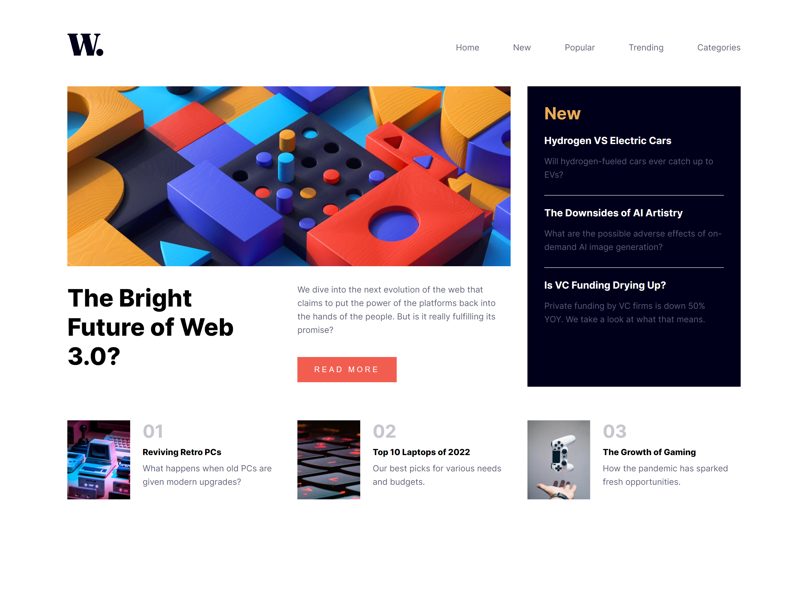

# Frontend Mentor - News Homepage Main

This is a solution to the [News Homepage Main challenge on Frontend Mentor](https://www.frontendmentor.io/challenges/news-homepage-H6SWTa1MFl). Frontend Mentor challenges help you improve your coding skills by building realistic projects.

### The challenge

Your challenge is to build out this news website homepage and get it looking as close to the design as possible.

You can use any tools you like to help you complete the challenge. So if you've got something you'd like to practice, feel free to give it a go.

Your users should be able to:

- View the optimal layout for the interface depending on their device's screen size
- See hover and focus states for all interactive elements on the page

### Screenshotls

### Links

- Solution URL: https://github.com/DanielaMichelle/News-Homepage-Main
- Live Site URL: https://danielamichelle.github.io/News-Homepage-Main/

### Built with

- Semantic HTML5 markup
- CSS custom properties
- JavaScript
